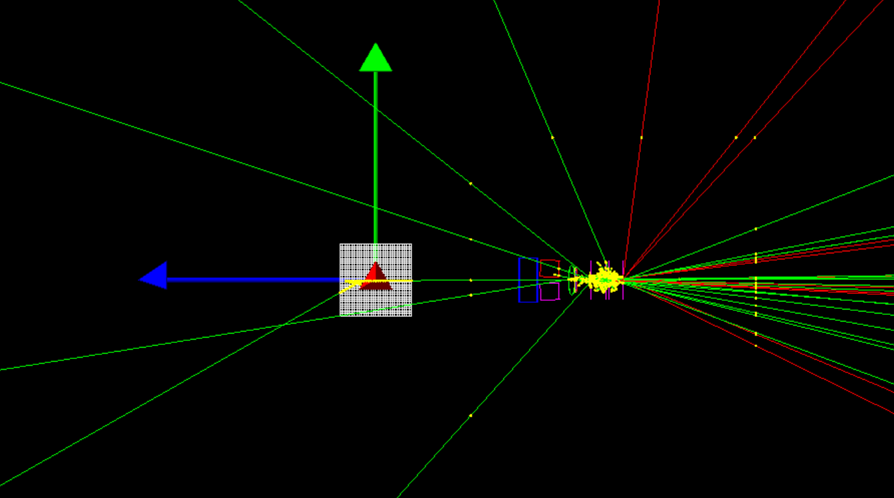
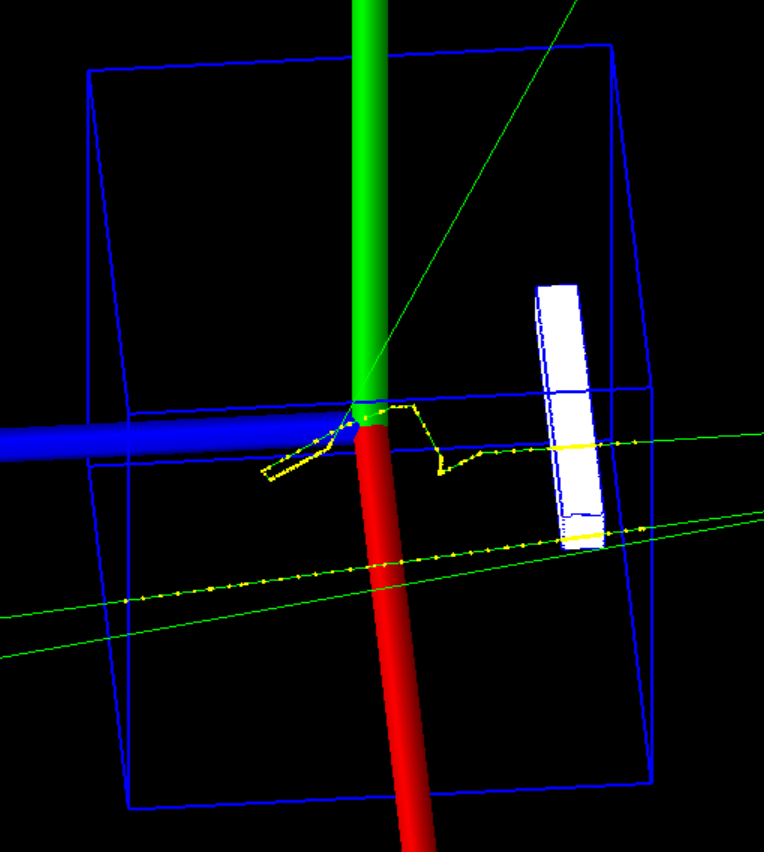
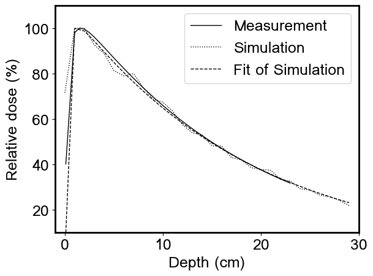
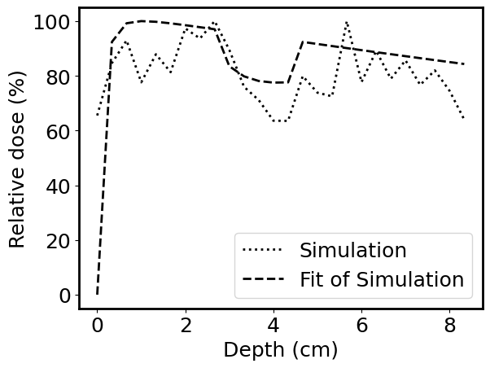

## Overview

### Introduction

This project investigates methods for improving food safety using high energy light sterilization. Our primary focus is on incorporating machine learning techniques into our existing stochastic computational models of UV and X-ray spectrum light. Leveraging these models, we aim to predict radiation transport endpoints while optimizing our physical systems for certain biological outcomes. This will enhance both the efficiency and efficacy of food safety measures involving radiation-based sterilization.

Additional research, ranging from radiation biophysics to bioactinide chemistry, by our group members may be found at: https://abergel.lbl.gov/research/

### Results

Our anticipated results include designing an optimal UV lighting system to decontaminate surfaces as plants grow and configuring a system for X-ray irradiation of harvested foods for full volume decontamination. These systems will be integrated into the hydroponic indoor farming unit and harvesting workflow set up at UC Berkeley.

So far, we have recreated the dose distributions from high energy x-ray beams for various media and geometric configurations using Monte Carlo simulation.
  
  

We have also successfully incorporated an empirical model of x-ray dose deposition in biological media into our simulation framework to enhance the accuracy and speed of our computation.

    
    

Fitting Monte Carlo radiation transport simulation results with an empirical model of megavoltage x-ray beams allows for rapid depth-dose calculations in water. The figure above illustrates the correction of low-statistic simulation results by fitting with an empirical function, improving our dose-depth errors to (a) within 2% for the full homogeneous water phantom after the first voxel and (b) 1.5% to 2% at the interfaces of a heterogeneous water phantom with air cavity when compared to measured data.

## Usage

### Setup
To recreate our radiation transport simulations, we recommend the Geant4 toolkit (https://geant4.web.cern.ch/). While many other Monte Carlo radiation transport codes are available, we have chosen Geant4 because it is open source, well-documented, and provides a large collection of example projects for programmers at any stage of learning. A major drawback of this option is that Geant4 is written in C++, which may be less popular than our choice for data post-processing, Python. 

### Running
Once the user is comfortable navigating the Geant4 simulation toolkit, they should open the Advanced Example "medical_linac" as this will provide the basis for our simulation. Our source code and macro files will be made available soon.

## Authors

Allison O'Brien

Rebecca Abergel

## Contact

For any questions, please contact us at abergel@berkeley.edu or allisonobrien@berkeley.edu.

## Citation

## License

No licensing at this time.

## Acknowledgements

## Funding

This work is supported by AFRI Competitive Grant no. 2020-67021-32855/project accession no. 1024262 from the USDA National Institute of Food and Agriculture. The grant is being administered through AIFS: the AI Institute for Next Generation Food Systems.

